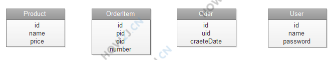
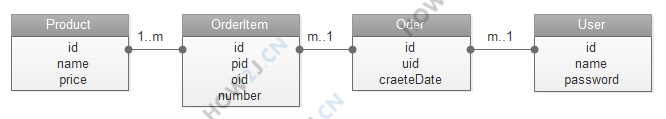

# simpleCart

### 概述

这个项目是基于Java实现了一个简易的购物车，实现的功能有用户登录、商品选择、加入购物车、生成订单等基础功能。参考How2Java网站的教程完成。

product.sql、user.sql、order.sql三个文件用于创建对应的数据库和表。

------

各文件夹中的内容解释如下：

### web

这个应用是通过Tomcat完成的。web文件夹中的设置是为了同tomcat衔接。

* WEB-INF 文件夹是必须的，其中包含一个classes文件夹，且eclipse中设置Java程序的编译结果保存在这个classes文件夹中，跟tomcat兼容。还有一个web.xml文件，是对于servlet的配置信息，主要功能是完成编译后的servlet类与url模式之间的匹配。
* js、css等文件在对应文件夹下保存。
* jsp文件也在此文件夹下，分别实现登录界面、展示产品界面、展示购物车界面。

除此之外，必须在Tomcat—>conf—>server.xml中添加一行

```java
<Context path="/cart" docBase="path\\to\\your\\project\\web" debug="0" reloadable="false" />
```

启动tomcat，访问`127.0.0.1/cart/listProduct`，会跳转到登录界面，用户名在user.sql中可以看到。登录后会看到产品界面，就可以验证功能了。

### bean

程序中包含四个类，分别是商品(product)、用户(user)、订单项(order item)、订单(order)。代码在包bean中。

其中的订单项对应的就是订单中的一条记录，包括对应的产品、数量。如果没有这个对象的话，用户、订单与产品之间就是一个多对多的关系，不易实现。

四个类的属性如下：



其中的pid、uid、oid分别表示的是产品编号、用户编号和订单编号。它们之间的类关系图如下：



* 产品和订单项之间的关系是**一对多**；
* 订单项和订单之间是关系是**多对一**；
* 订单和用户之间的关系是**多对一**。

### dao

dao包中保存着各个类的DAO程序，实现与数据库的交互。

因为是简易程序，对于产品和用户都只提供了查询功能，只用于展示产品和验证登录信息，没有实现注册新用户和添加新产品。

### filter

filter包中包含两个过滤器，AuthFilter用于验证权限，如果用户未登录的话，则跳转到登录界面。EncodingFilter则用于设置request的编码格式为UTF-8，实现对中文的支持。

### servlet

servlet包中是实现后台逻辑的servlet程序，从名字就可以看出各自的功能。

